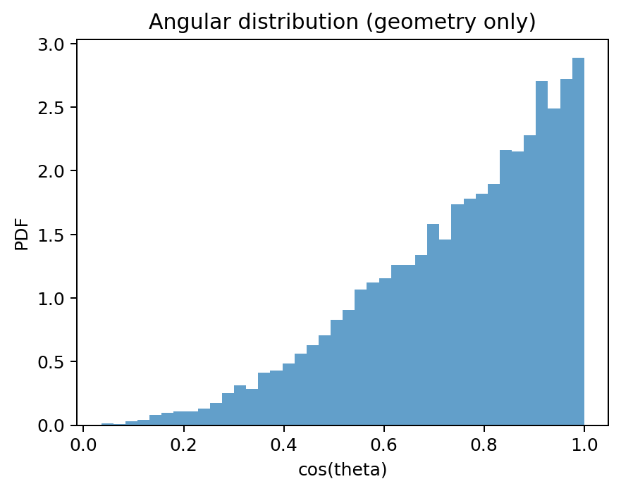
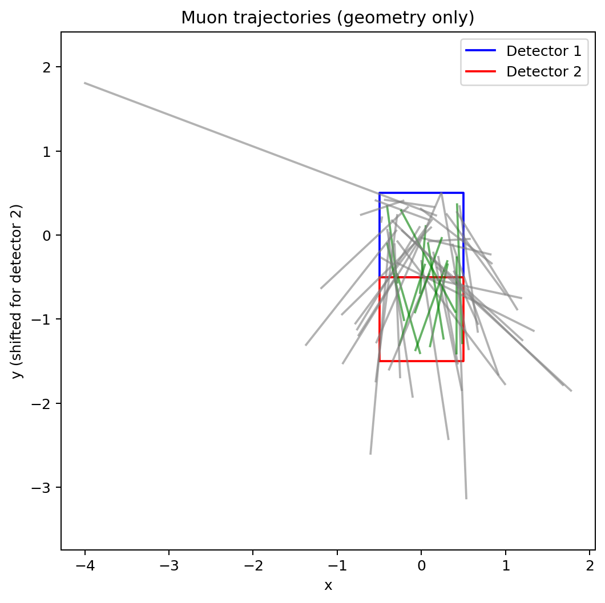
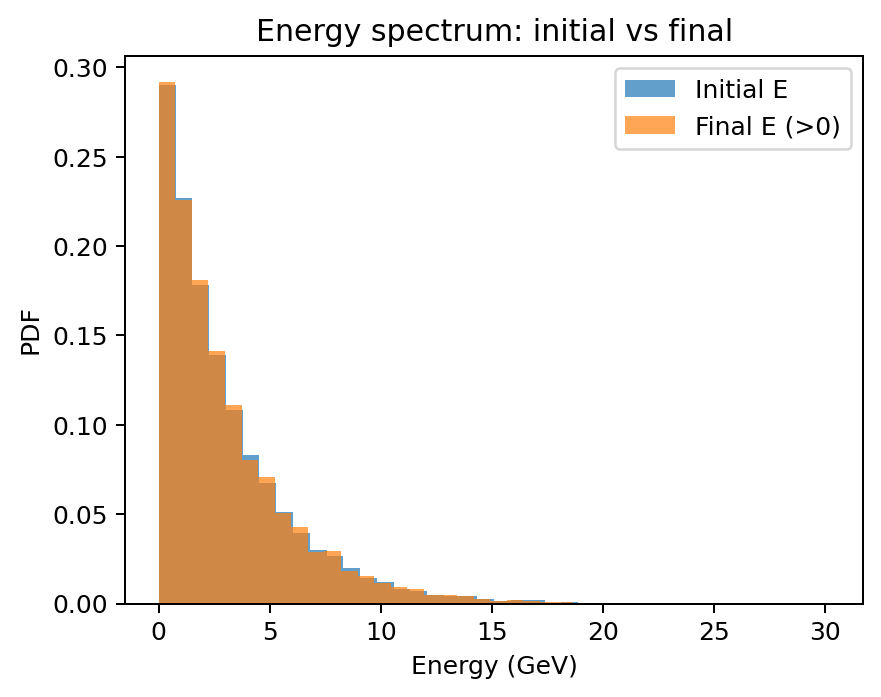
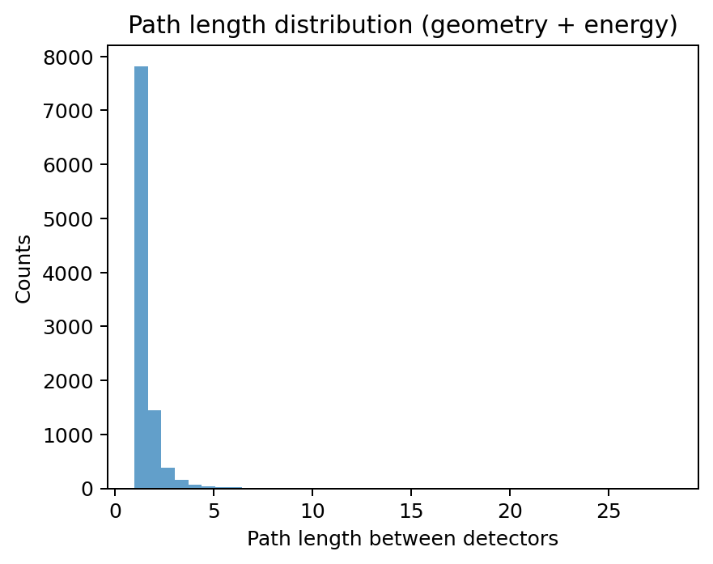
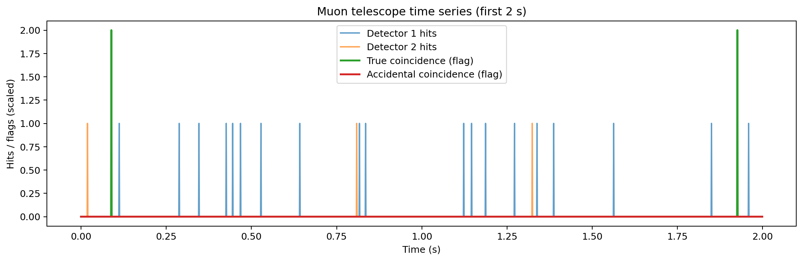
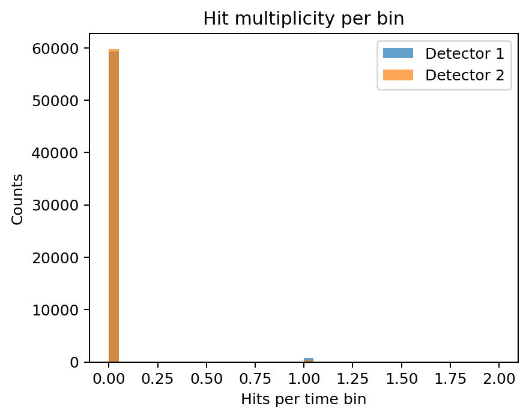

# Monte Carlo Simulation of a Two-Layer Muon Telescope

A simplified Monte Carlo simulation of cosmic-ray muons passing through a two-layer detector system.

The project models:

- Muon angular distributions
- Two-layer detector geometry
- Muon trajectories
- Energy loss during propagation
- Survival to the second detector
- Time-dependent detector hits
- Detector noise
- True and accidental coincidence events

## Project Overview

A two-layer muon telescope can identify candidate muon events by requiring a particle to produce signals in both detector layers.

This simulation explores how geometric acceptance and a simplified energy-loss model affect the coincidence rate.

The simulation proceeds through three main stages:

1. Geometry-only simulation
2. Geometry + energy loss
3. Time-series simulation with detector noise

## Physical Model

### Angular distribution

Muon zenith angles are sampled using a simplified angular distribution favoring trajectories close to the vertical direction.

### Detector geometry

For a detector separation `d`, the approximate path length is

\[
\ell = \frac{d}{\cos\theta}.
\]

The simulated trajectory is propagated from the first detector to the second detector and checked against the detector dimensions.

### Energy loss

The project uses a simplified linear energy-loss model:

\[
E_f = E_i - \alpha \ell
\]

where:

- \(E_i\) is the initial muon energy
- \(E_f\) is the final muon energy
- \(\alpha\) is a simplified energy-loss coefficient
- \(\ell\) is the path length between the detectors

A muon is considered to survive if its final energy remains above the chosen threshold.

> **Model limitation:** The energy-loss model is a simplified toy model and is not a full Bethe-Bloch calculation.

## Time-Series Detector Model

The simulation also models detector activity over a 60-second measurement period using 1 ms time bins.

The model includes:

- True muon arrivals
- Independent detector noise
- True coincidence events
- Approximate accidental coincidence events

The detector noise and true-muon arrival processes are modeled using Poisson statistics.

## Results

### Angular distribution

The sampled muon directions follow the simplified \(\cos^2\theta\) model used in the simulation.



### Muon trajectories

The geometry simulation propagates sampled trajectories between the two detector layers.



### Energy loss

The initial and final energy distributions illustrate the effect of the simplified path-length-dependent energy-loss model.



### Path length

Inclined trajectories travel a longer distance between the detector layers.



### Geometry-only simulation

For 10,000 simulated muons:

| Quantity | Result |
|---|---:|
| Detector 1 hits | 10,000 |
| Detector 2 hits | 2,667 |
| Geometric coincidences | 2,667 |
| Geometric coincidence fraction | 26.67% |

### Geometry + energy loss

| Quantity | Result |
|---|---:|
| Detector 1 hits | 10,000 |
| Detector 2 geometric hits | 2,667 |
| Muons surviving to Detector 2 | 7,721 |
| Coincidences with survival | 2,100 |
| Combined coincidence fraction | 21.0% |

### Time-series with detector noise

For a 60-second simulation:

| Quantity | Result |
|---|---:|
| Detector 1 hits | 719 |
| Detector 2 hits | 235 |
| True coincidences | 118 |
| Observed accidental coincidences | 0 |
| Rough expected accidental coincidences | 0.24 |

The accidental-coincidence expectation is a rough estimate based on the detector noise rates and coincidence time bin.

### Time-series detector activity

The first 2 seconds of the simulated detector time series are shown below.



### Hit multiplicity

The distribution of hits per 1 ms time bin is shown below.



## Visualizations

The notebook produces:

- Muon angular distribution
- Muon trajectories through the two detector layers
- Initial and final energy spectra
- Path-length distribution
- Detector hit time series
- Hit multiplicity distributions

## Limitations

This project is intended as a simplified educational Monte Carlo model rather than a full detector simulation.

Important simplifications include:

- The energy-loss model is linear rather than a full Bethe-Bloch treatment.
- Detector response is represented using simplified hit/no-hit conditions.
- Detector noise is modeled as independent Poisson processes.
- The accidental-coincidence calculation is only an approximate estimate.
- No detailed scintillator, photomultiplier, electronics, or detector-resolution model is included.

## Technologies

- Python
- NumPy
- Matplotlib
- Jupyter Notebook
- Monte Carlo methods
- Probability and Poisson statistics

## How to Run

Clone the repository and install the dependencies:

```bash
pip install -r requirements.txt
```

Then open:

```text
muon_telescope_simulation.ipynb
```

using Jupyter Notebook or VS Code.

## Learning Objectives

This project was developed to understand the computational and physical ideas behind a simplified particle-detector simulation, including:

- Random sampling
- Monte Carlo methods
- Detector geometry
- Particle trajectories
- Energy-loss modeling
- Statistical fluctuations
- Poisson processes
- Coincidence detection
- Data visualization

## Author

Abhinab

Physics Undergraduate Student  
IISER Berhampur
